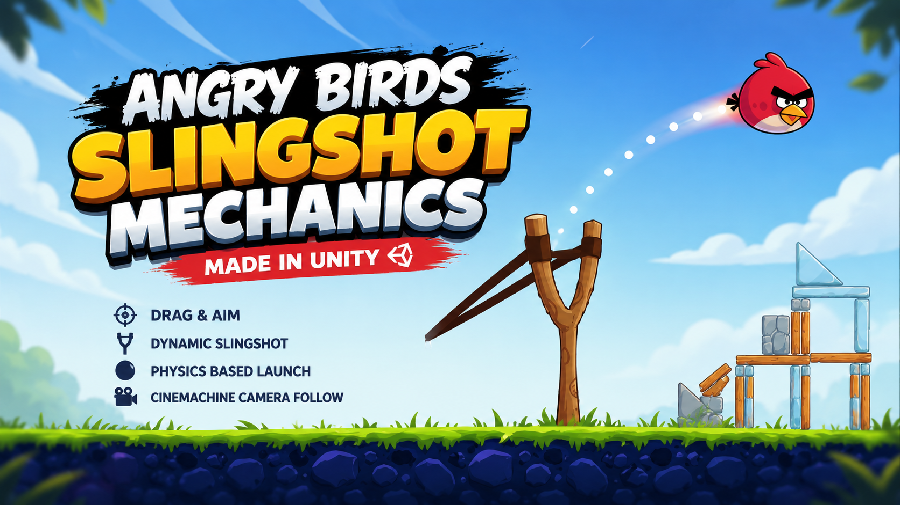
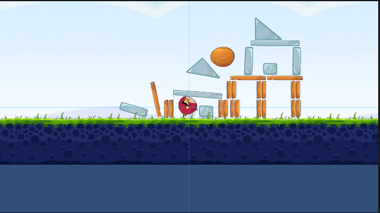
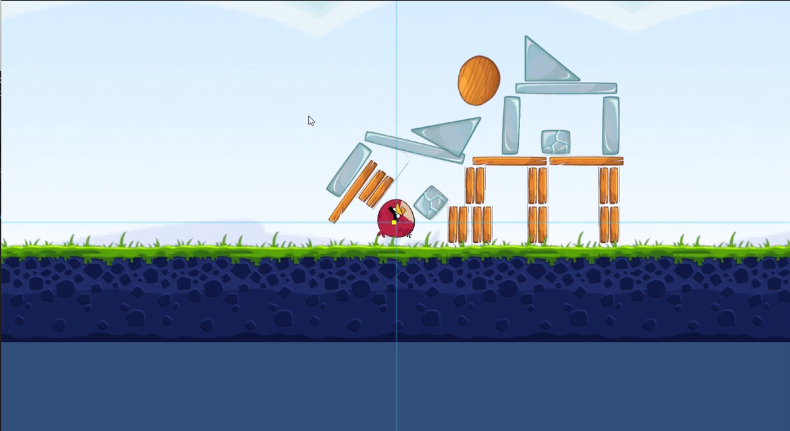
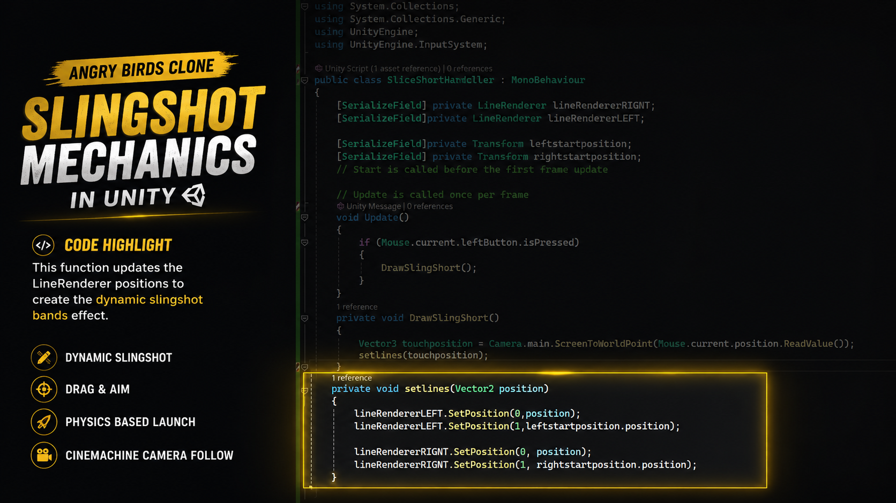
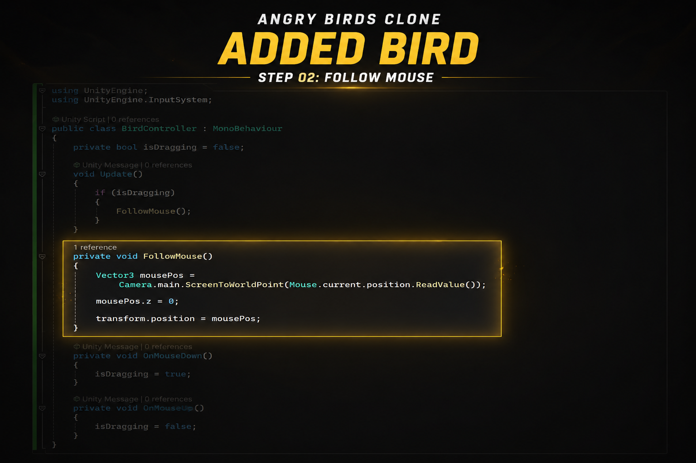
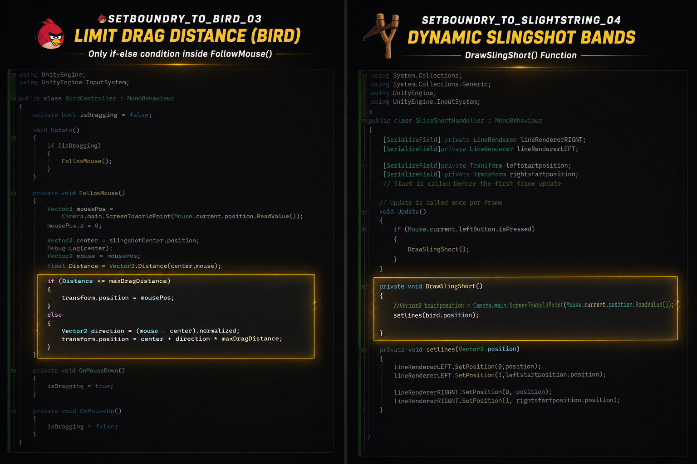

# 🎮 Angry Birds Slingshot Mechanics (Unity 6)

A recreation of the core **Angry Birds Slingshot Mechanics** built in **Unity 6** using **C#**.

The goal of this project was to understand how the original slingshot gameplay works by implementing each system from scratch rather than copying existing code. This project focuses on gameplay programming fundamentals including mouse input, drag constraints, dynamic line rendering, physics-based launching, and camera tracking.

---

## 🎥 Gameplay

https://github.com/ABIKARTHICKGDEV/Angry-Birds-Slingshot-Mechanics-Unity-6-/blob/main/Images/gameplay.mp4

---

## 📷 Preview

### Gameplay

<p align="center">

</p>

---

## ✨ Features

- 🐦 Mouse Drag & Drop Controls
- 🎯 Drag Distance Limitation
- 📏 Circular Drag Boundary
- 🎯 Dynamic Slingshot Bands
- ⚡ Physics-Based Launch
- 🎥 Cinemachine Camera Follow
- 🧩 Modular Gameplay Architecture
- 🖱️ Unity Input System

---

# 🛠️ Implementation Breakdown

## 1️⃣ Bird Dragging

The bird follows the mouse cursor while dragging.

<p align="center">

</p>

### Responsible Script

```
BirdController.cs
```

Main responsibilities

- Detect mouse interaction
- Convert Screen Space to World Space
- Move bird while dragging
- Handle drag state

---

## 2️⃣ Drag Boundary

The bird movement is constrained inside a maximum drag radius to produce consistent launch behavior.

<p align="center">

</p>

Implemented using

- Vector2.Distance()
- Normalized Direction
- Maximum Drag Distance

---

## 3️⃣ Dynamic Slingshot Bands

The LineRenderer updates continuously while dragging to create realistic elastic bands.

<p align="center">

</p>

Responsible Script

```
SliceShortHandeller.cs
```

---

## 4️⃣ Launch Physics

Launch force is calculated based on the distance between the slingshot center and the bird.

<p align="center">

</p>

Implemented using

- Rigidbody2D
- ForceMode2D.Impulse
- Direction Vector
- Launch Power Multiplier

---

## 5️⃣ Camera Tracking

After launching, the Cinemachine Camera automatically follows the bird.

<p align="center">

</p>

Responsible Script

```
CameraController.cs
```

---

# 📂 Project Structure

```
Angry-Birds-Slingshot-Mechanics-Unity6
│
├── README.md
├── LICENSE
│
├── Images/
│   ├── cover.png
│   ├── gameplay.mp4
│   ├── screenshot1.png
│   ├── screenshot2.png
│   ├── code1.png
│   ├── code2.png
│   ├── code3.png
│
├── Scripts/
│   ├── BirdController.cs
│   ├── CameraController.cs
│   └── SliceShortHandeller.cs
```

---

# 🧠 Concepts Learned

- Unity 6
- C#
- Gameplay Programming
- Unity Input System
- Screen to World Position
- Vector Mathematics
- LineRenderer
- Rigidbody2D Physics
- ForceMode2D
- Drag Constraints
- Cinemachine
- Camera Follow Systems
- Modular Script Design

---

# 🚀 Future Improvements

- Multiple Bird Types
- Trajectory Prediction
- Collision Sound Effects
- Particle Effects
- Level Manager
- Multiple Levels
- Score System
- Bird Respawn System
- UI & Game States

---

# 🔗 Connect With Me

**LinkedIn**

(Add your LinkedIn profile link)

**Portfolio**

(Add your portfolio link)

---

If you found this project interesting, consider giving the repository a ⭐.
